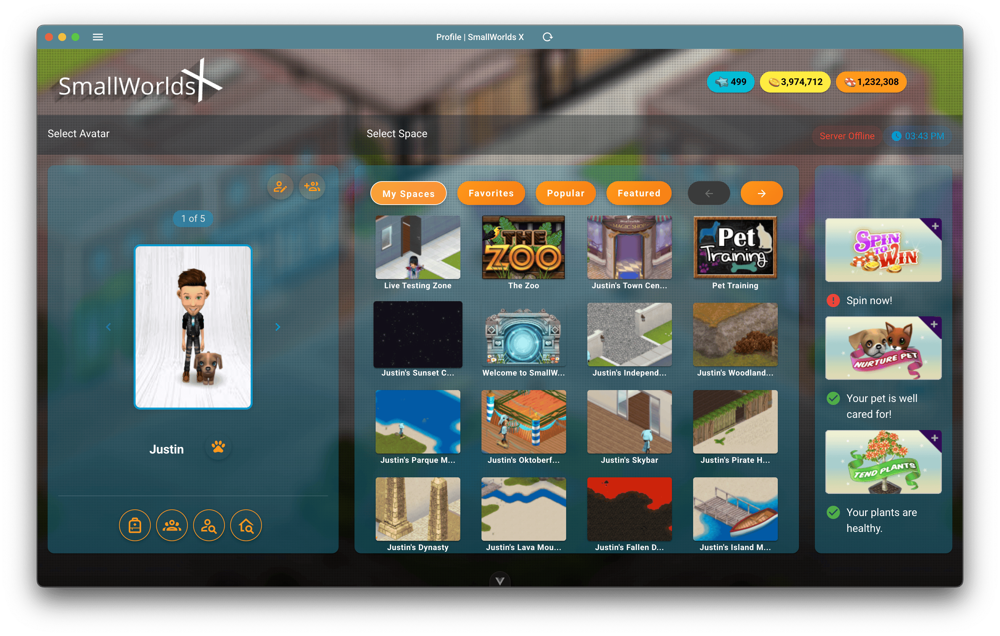

# SmallWorlds Client



The official client for SmallWorlds, built with Electron and Vue.js.

## Table of Contents

- [About The Project](#about-the-project)
- [Built With](#built-with)
- [Getting Started](#getting-started)
  - [Prerequisites](#prerequisites)
  - [Installation](#installation)
- [Usage](#usage)
- [Contributing](#contributing)
- [License](#license)
- [Contact](#contact)

## About The Project

This repository contains the source code for the SmallWorlds Client. It's a desktop application built using modern web technologies to provide a rich user experience for the SmallWorlds game.

## Built With

This project is built with a variety of technologies, including:

*   [Electron](https://www.electronjs.org/)
*   [Vue.js](https://vuejs.org/)
*   [Vuetify](https://vuetifyjs.com/en/)
*   [Pinia](https://pinia.vuejs.org/)
*   [Electron Builder](https://www.electron.build/)
*   [Vite](https://vitejs.dev/)

## Getting Started

To get a local copy up and running follow these simple steps.

### Prerequisites

You must have Node.js and npm installed to build and run this project.

*   npm
    ```sh
    npm install npm@latest -g
    ```

### Installation

1.  Clone the repo
    ```sh
    git clone https://github.com/boarhatgames/client.git
    ```
2.  Install NPM packages
    ```sh
    npm install
    ```

## Usage

Several scripts are available to run, build, and distribute the application.

*   **Run in development mode:**
    This will start a development server with hot-reloading.
    ``` Make sure to rename `package-dev.json` to `package.json` before running this command. ```
    ```sh
    npm run dev
    ```

*   **Start the application:**
    This will run the compiled application.
    ```sh
    npm run start
    ```

*   **Build for production:**
    This will build the application for production. Please note that this build is for x64 architecture only so that the flash plugin can be used.
    
    ``` Make sure to rename `package-prod.json` to `package.json` before running this command. ```
    ```sh
    npm run build
    ```

*   **Package for distribution:**
    To create a distributable version of the application, first switch `package-prod.json` to `package.json` and then run:
    ```sh
    npm run release
    ```
    This will create installers for your current operating system.

*   **Publish a new release:**
    This will build and publish a new release for Mac, Windows, and Linux.
    ```sh
    npm run publish
    ```

## Contributing

Contributions are what make the open source community such an amazing place to learn, inspire, and create. Any contributions you make are **greatly appreciated**.

1.  Fork the Project
2.  Create your Feature Branch (`git checkout -b feature/AmazingFeature`)
3.  Commit your Changes (`git commit -m 'Add some AmazingFeature'`)
4.  Push to the Branch (`git push origin feature/AmazingFeature`)
5.  Open a Pull Request

## License

Distributed under the AGPL-3.0 License. See `LICENSE` for more information.
